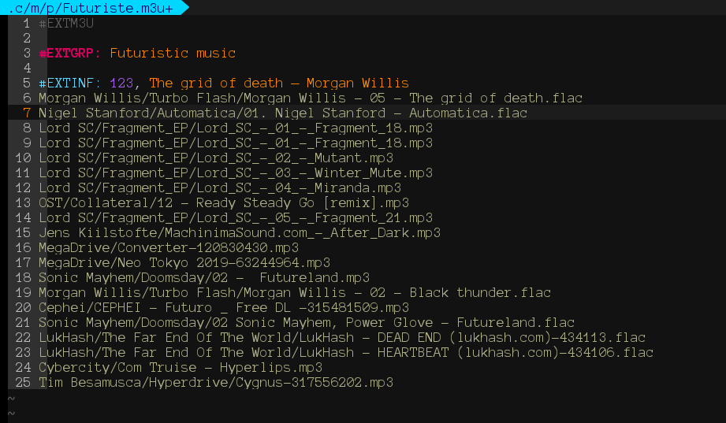

# vim-m3u-syntax
Syntax description file for m3u file format in vim




## Installation
You can install the m3u (and also m3u8) syntax file in `~/.vim/syntax` in many Unix systems.

I recommend you to add `# vim:filetype=m3u` at the end of your m3u file or the following line on your vimrc:

```vim
autocmd BufEnter *.m3u\(8\|\)         setlocal filetype=m3u
```
